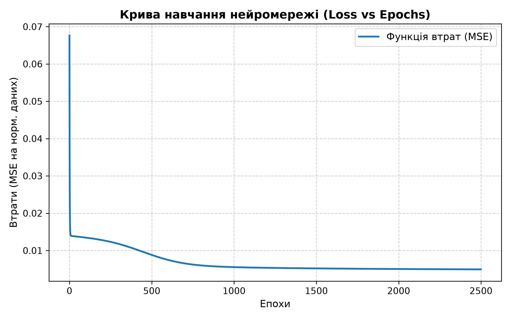
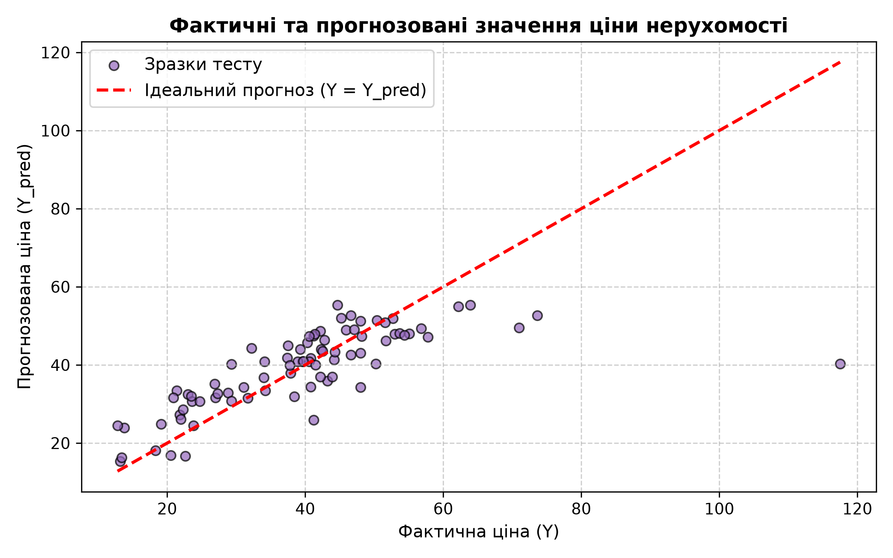

# Лабораторна робота №1: Реалізація простої багатошарової нейромережі

Реалізація повнозв'язної нейронної мережі (багатошарового перцептрона) з одним прихованим шаром для задачі регресії з нуля на базі бібліотеки **NumPy** (без використання PyTorch, TensorFlow чи Scikit-Learn).

## Завдання
- Спрогнозувати вартість нерухомості за одиницю площі ($Y$) на основі 6 вхідних параметрів ($X_1 \dots X_6$) з датасету [Real Estate Price Prediction](https://www.kaggle.com/datasets/quantbruce/real-estate-price-prediction).
- Реалізувати алгоритми прямого поширення (Forward Propagation), обчислення втрат (MSE) та зворотного поширення помилки (Backward Propagation) з градієнтним спуском за формулами з методички.
- Проаналізувати динаміку збіжності, вплив кількості нейронів прихованого шару та кількості епох на точність моделі.

## Архітектура та математична модель
- **Вхідний шар**: 6 нейронів ($X_1 \dots X_6$).
- **Прихований шар**: $h$ нейронів (за замовчуванням 8), функція активації — логістичний сигмоїд $\sigma(z) = \frac{1}{1 + e^{-z}}$.
- **Вихідний шар**: 1 нейрон ($\hat{Y}$), функція активації — сигмоїд $\sigma(z)$.
- **Попередня обробка**: Min-Max Scaling для приведення ознак та цільової змінної до діапазону $[0, 1]$.
- **Формули**:
  - $Z_1 = X \cdot W_1 + b_1, \quad A_1 = \sigma(Z_1)$
  - $Z_2 = A_1 \cdot W_2 + b_2, \quad A_2 = \sigma(Z_2)$
  - $L = \frac{1}{m} \sum (Y - A_2)^2$ (MSE Loss)
  - $dZ_2 = A_2 - Y$
  - $dW_2 = \frac{1}{m} A_1^T \cdot dZ_2, \quad db_2 = \frac{1}{m} \sum dZ_2$
  - $dA_1 = dZ_2 \cdot W_2^T, \quad dZ_1 = dA_1 \odot (A_1 \odot (1 - A_1))$
  - $dW_1 = \frac{1}{m} X^T \cdot dZ_1, \quad db_1 = \frac{1}{m} \sum dZ_1$
  - $W := W - \alpha \cdot dW, \quad b := b - \alpha \cdot db$ (де $\alpha = 0.5$)

## Структура проекту
```
.
├── Real estate.csv          # Вхідний датасет
├── main.py                  # Код нейромережі та запуск експериментів
├── requirements.txt         # Список залежностей (numpy, matplotlib)
├── .gitignore               # Ігнорування віртуального середовища та кешу
├── plots/                   # Папка зі згенерованими графіками
│   ├── learning_curve.png   # Крива навчання (Loss vs Epochs)
│   ├── neurons_comparison.png # Залежність помилки від кількості нейронів
│   ├── epochs_comparison.png  # Залежність помилки від кількості епох
│   └── predictions_plot.png # Фактичні ціни vs прогнозовані
├── Звіт_Лабораторна_1.docx  # Звіт за вимогами методички (без води, з формулами)
└── Звіт_Лабораторна_1.pdf   # Згенерований PDF звіту для швидкого перегляду
```

## Встановлення та запуск у віртуальному середовищі

1. Перейти у робочу директорію:
   ```bash
   cd Lab1
   ```

2. Створити та активувати віртуальне середовище:
   - **Linux / macOS:**
     ```bash
     python3 -m venv .venv
     source .venv/bin/activate
     ```
   - **Windows (PowerShell):**
     ```powershell
     python -m venv .venv
     .venv\Scripts\Activate.ps1
     ```
   - **Windows (CMD):**
     ```cmd
     python -m venv .venv
     .venv\Scripts\activate.bat
     ```

3. Встановити залежності:
   ```bash
   pip install -r requirements.txt
   ```

4. Запустити розрахунки та тренування мережі:
   ```bash
   python main.py
   ```
   Скрипт навчить модель, виведе всі таблиці метрик у консоль та збереже графіки в папку `plots/`.

5. Після завершення роботи віртуальне середовище можна деактивувати:
   ```bash
   deactivate
   ```

## Результати
- **Базова модель** (8 нейронів, 2500 епох): $MSE \approx 121.3$, $RMSE \approx 11.0$, $MAE \approx 6.50$, $R^2 \approx 0.506$.
- **Вплив епох**: при зростанні від 200 до 5000 епох значення тестового MSE знижується з $234.9$ ($R^2 = 0.04$) до $115.2$ ($R^2 = 0.531$).
- **Вплив нейронів**: для даного датасету оптимальним є вибір 8–16 нейронів у прихованому шарі.

| Графік кривої навчання | Фактичні vs Прогнозовані ціни |
| :---: | :---: |
|  |  |
