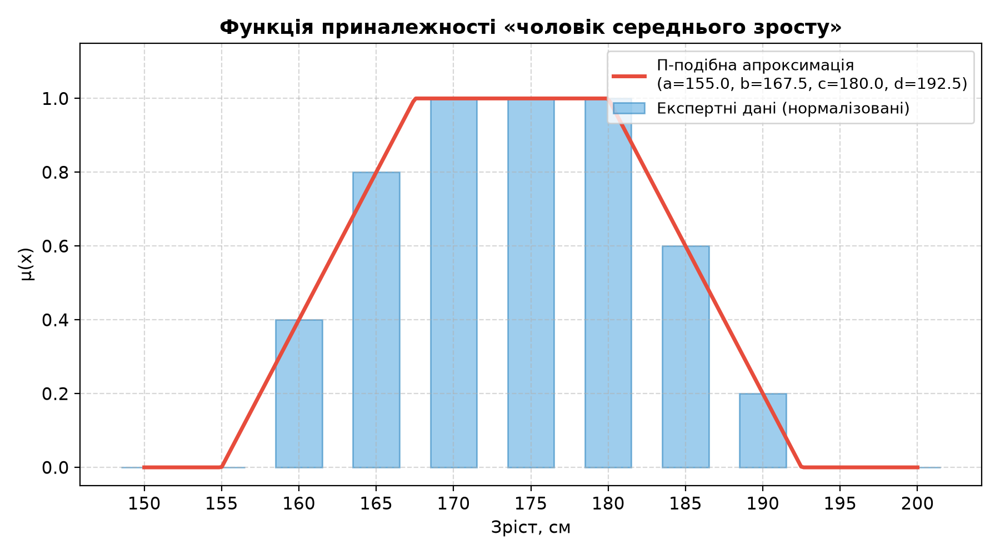
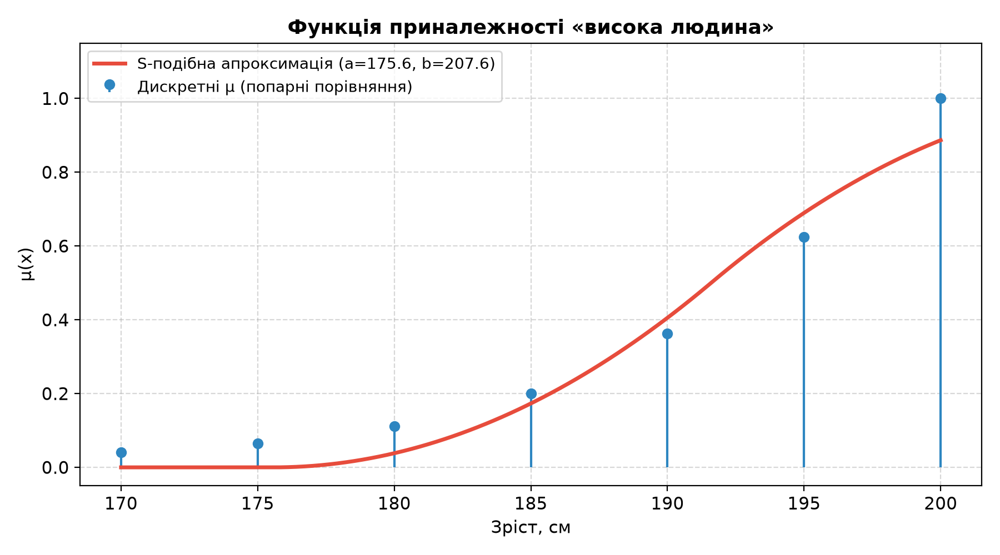
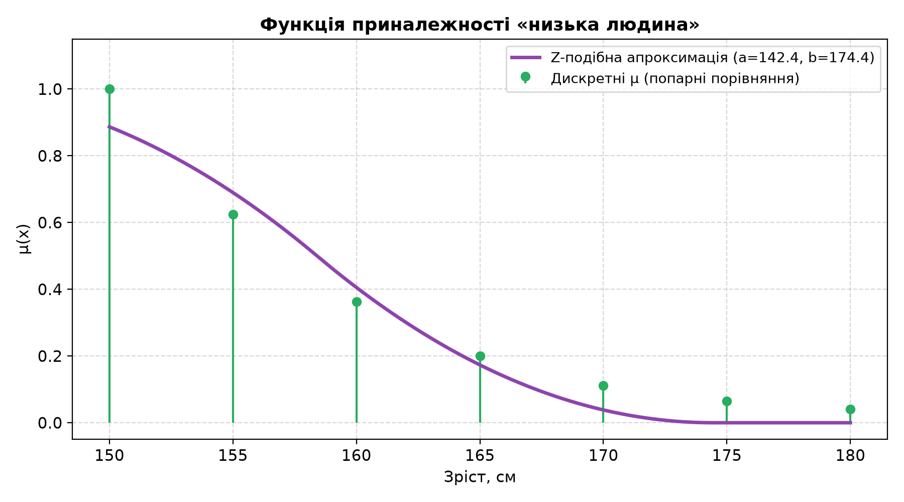

# Лабораторна робота №2: Побудова функцій приналежності нечітких множин

Реалізація прямого та непрямого методів побудови функцій приналежності нечітких множин з апроксимацією П-, S- та Z-подібними функціями.

## Завдання
1. **Прямий метод** — побудова функції приналежності нечіткої множини «чоловік середнього зросту» на основі опитування 5 експертів (бінарні оцінки), апроксимація П-подібною функцією.
2. **Непрямий метод** — побудова функцій приналежності нечітких множин «висока людина» та «низька людина» на основі матриць попарних порівнянь (шкала Сааті), апроксимація S- та Z-подібними функціями, визначення носія, ядра та границь.

## Математичні формули

- **Ступінь приналежності (прямий метод)**: $\mu_{A_j}(x_i) = \frac{1}{k} \sum_{k=1}^{K} b_{ik,j}$
- **Нормалізація**: $\mu'_{A_j}(x_i) = \frac{\mu_{A_j}(x_i)}{\sup \mu_{A_j}(x)}$
- **Власний вектор (непрямий метод)**: $\omega_i = \frac{\sqrt[n]{\prod_{j=1}^{n} a_{ij}}}{\sum_{i=1}^{n} \sqrt[n]{\prod_{j=1}^{n} a_{ij}}}$

## Структура проекту
```
.
├── main.py                      # Основний скрипт (Завдання 1 + Завдання 2)
├── requirements.txt             # Залежності (numpy, matplotlib, scipy)
├── README.md                    # Опис проекту
├── plots/                       # Згенеровані графіки
│   ├── task1_membership.png     # ФП «чоловік середнього зросту» + П-апроксимація
│   ├── task2_high.png           # ФП «висока людина» + S-апроксимація
│   └── task2_low.png            # ФП «низька людина» + Z-апроксимація
├── Звіт_Лабораторна_2.docx     # Звіт
└── L2.pdf                       # Методичні вказівки
```

## Встановлення та запуск

```bash
cd Lab2
python3 -m venv .venv
source .venv/bin/activate
pip install -r requirements.txt
python3 main.py
deactivate
```

## Результати

### Завдання 1 — «чоловік середнього зросту»
| Зріст, см | 150 | 155 | 160 | 165 | 170 | 175 | 180 | 185 | 190 | 195 | 200 |
|-----------|-----|-----|-----|-----|-----|-----|-----|-----|-----|-----|-----|
| μ(x)      | 0   | 0   | 0.4 | 0.8 | 1.0 | 1.0 | 1.0 | 0.6 | 0.2 | 0   | 0   |

П-подібна апроксимація: a=155.0, b=167.5, c=180.0, d=192.5

### Завдання 2 — попарні порівняння

**«Висока людина»** (S-подібна, a=175.6, b=207.6):
- Носій: [170–200] см, Ядро: [200] см, Границі (α=0.5): [195, 200] см

**«Низька людина»** (Z-подібна, a=142.4, b=174.4):
- Носій: [150–180] см, Ядро: [150] см, Границі (α=0.5): [150, 155] см

| Графік «чоловік середнього зросту» | Графік «висока людина» | Графік «низька людина» |
| :---: | :---: | :---: |
|  |  |  |
